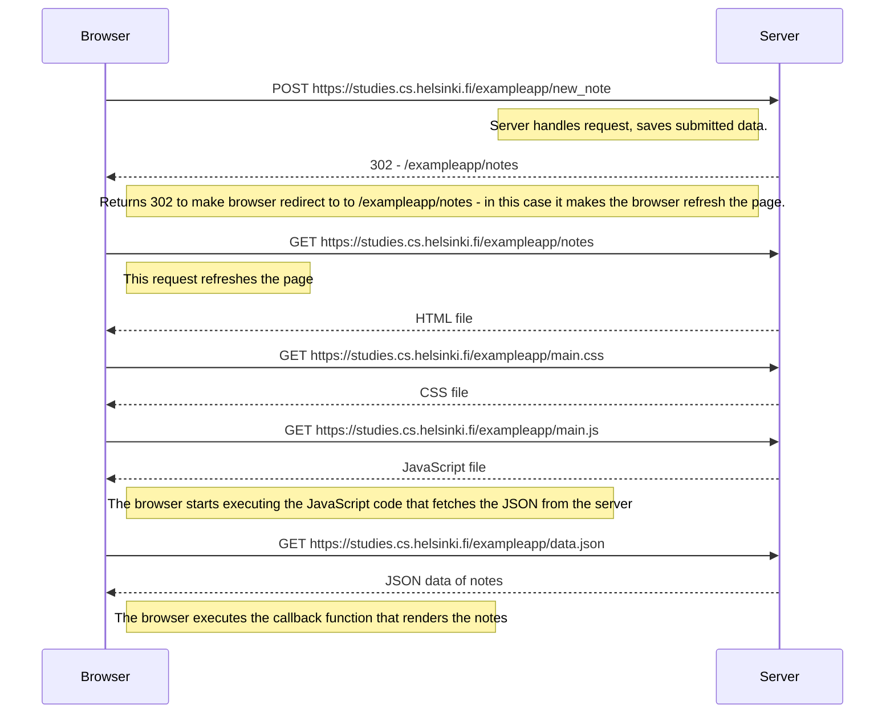

```mermaid
sequenceDiagram
    participant browser as Browser
    participant server as Server

    browser->>server: POST https://studies.cs.helsinki.fi/exampleapp/new_note
    Note left of server: Server handles request, saves submitted data.

    server-->>browser: 302 - /exampleapp/notes
    Note left of server: Returns 302 to make browser redirect to to /exampleapp/notes - in this case it makes the browser refresh the page.
    
    browser->>server: GET https://studies.cs.helsinki.fi/exampleapp/notes
    Note right of browser: This request refreshes the page
    
    server-->>browser: HTML file

    browser->>server: GET https://studies.cs.helsinki.fi/exampleapp/main.css

    server-->>browser: CSS file

    browser->>server: GET https://studies.cs.helsinki.fi/exampleapp/main.js
    server-->>browser: JavaScript file
    
    Note right of browser: The browser starts executing the JavaScript code that fetches the JSON from the server
    
    browser->>server: GET https://studies.cs.helsinki.fi/exampleapp/data.json
    server-->>browser: JSON data of notes

    Note right of browser: The browser executes the callback function that renders the notes
```