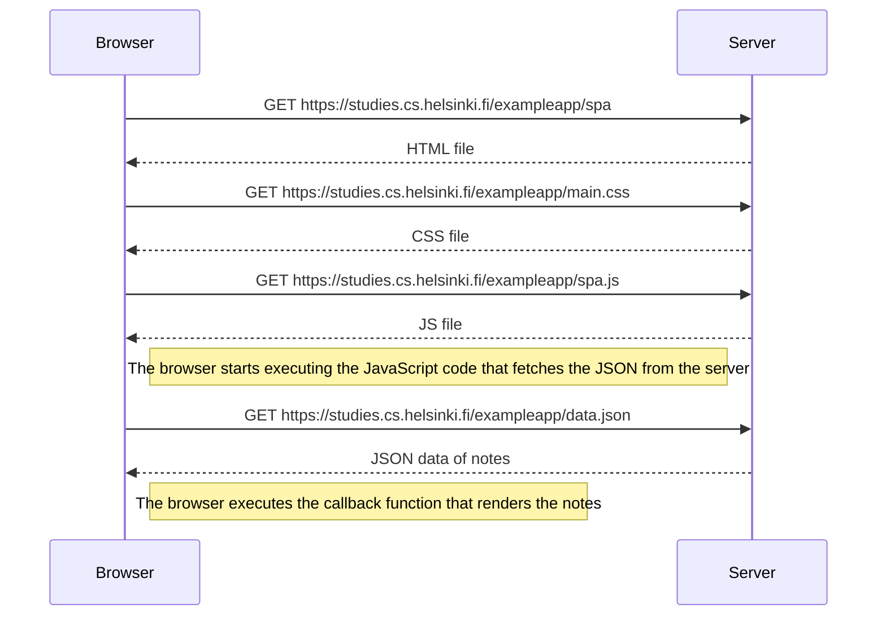

Tehtävä 0.5

```mermaid
sequenceDiagram
    participant browser as Browser
    participant server as Server

    browser->>server: GET https://studies.cs.helsinki.fi/exampleapp/spa

    server-->>browser: HTML file
    
    browser->>server: GET https://studies.cs.helsinki.fi/exampleapp/main.css
    
    server-->>browser: CSS file

    browser->>server: GET https://studies.cs.helsinki.fi/exampleapp/spa.js

    server-->>browser: JS file
    
    Note right of browser: The browser starts executing the JavaScript code that fetches the JSON from the server
    
    browser->>server: GET https://studies.cs.helsinki.fi/exampleapp/data.json
    server-->>browser: JSON data of notes

    Note right of browser: The browser executes the callback function that renders the notes
```